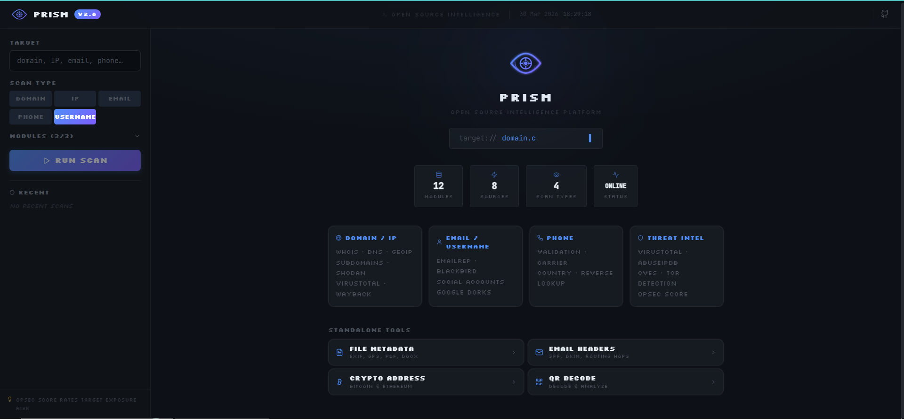
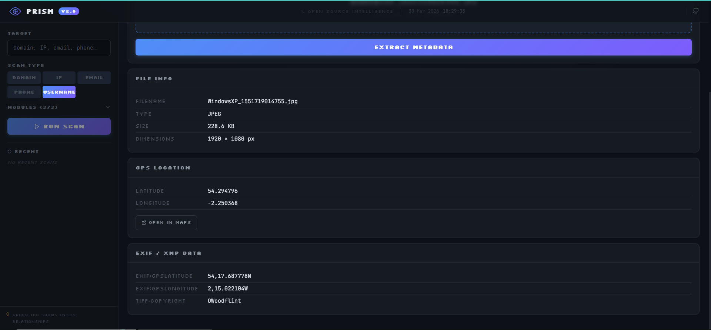
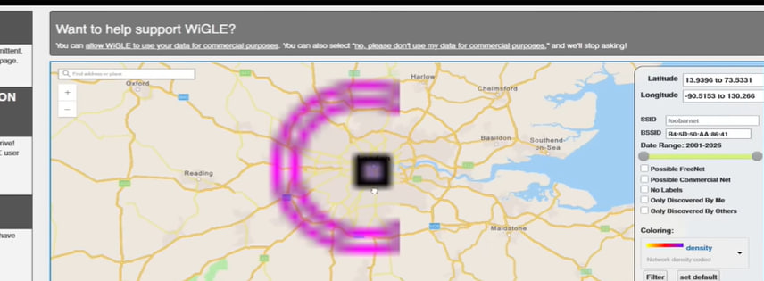
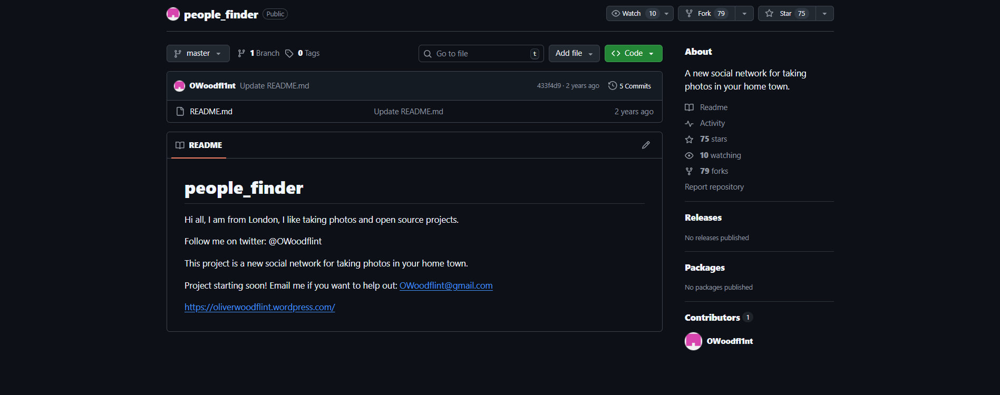
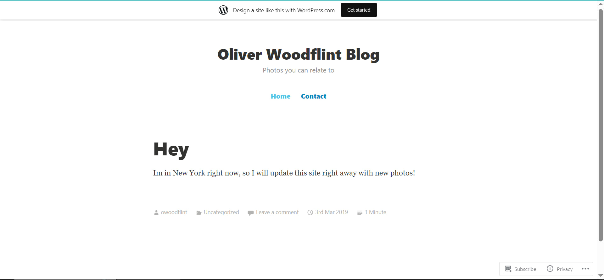
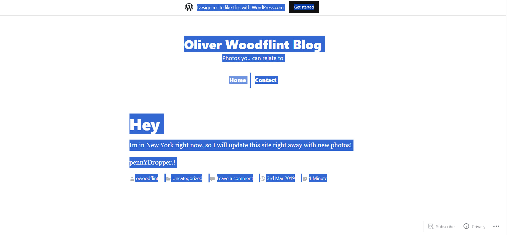

# TryHackMe — OhSINT Writeup

**Platform:** TryHackMe  
**Room:** [OhSINT](https://tryhackme.com/room/ohsint)  
**Category:** OSINT  
**Difficulty:** Easy  
**Tool developed by author:** PRISM — Open Source Intelligence Platform *(coming soon)*

---

## Objective

A single image file is provided as the only input: a Windows XP desktop wallpaper. The goal is to apply open-source intelligence techniques to uncover personal information about the individual who originally uploaded the image and answer seven investigative questions.

---

## Tools Used

| Tool | Purpose |
|------|---------|
| **PRISM** *(coming soon)* | EXIF metadata extraction from the target image |
| **Twitter / X** | Social media profile discovery |
| **WiGLE.net** | WiFi network geolocation by BSSID |
| **Google** | Surface the target's GitHub profile |
| **GitHub** | Email address retrieval |
| **WordPress** | Current location and password discovery |

---

## Walkthrough

### Step 1 — EXIF Metadata Extraction via PRISM

The investigation begins with static analysis of the provided image file. Using the **File Metadata** module in **PRISM** — an OSINT platform developed by the author — all embedded EXIF and XMP tags were automatically extracted and parsed.

**Extracted EXIF data:**

| Field | Value |
|-------|-------|
| Filename | `WindowsXP_1551719814755.jpg` |
| Dimensions | 1920 × 1080 px |
| GPS Latitude | 54.294796 |
| GPS Longitude | -2.258368 |
| TIFF:Copyright | `OWoodflint` |

The `Copyright` field exposes a username: **OWoodflint**. This becomes the primary pivot point for further investigation.

---

### Step 2 — Social Media Profile Discovery

Searching for the username `OWoodflint` on Twitter (X) returns an active account with 500+ followers.

A review of the account's posts reveals the following disclosure:

> "From my house I can get free wifi ;D  
> Bssid: B4:5D:50:AA:86:41 — Go nuts!"

The tweet publicly exposes the BSSID of the target's home wireless access point.

**Finding — Avatar:** cat

---

### Step 3 — WiFi Network Geolocation via WiGLE

The BSSID `B4:5D:50:AA:86:41` was submitted to [WiGLE.net](https://wigle.net), a global wireless network database, to identify the physical location and network name of the access point.

The lookup confirms the network's location in London and returns the associated SSID.

**Finding — City:** London  
**Finding — SSID:** UnileverWiFi

---

### Step 4 — GitHub Profile and Email Address

A search for the username `OWoodflint` via Google surfaces a public GitHub repository.

The repository `OWoodfl1nt/people_finder` contains a README file with the target's personal contact information.

> "Email me if you want to help out: OWoodflint@gmail.com"

**Finding — Email:** OWoodflint@gmail.com  
**Finding — Source:** GitHub

---

### Step 5 — Blog Post: Current Location

The GitHub README references a personal WordPress blog at `https://oliverwoodflint.wordpress.com/`. The most recent post contains a location disclosure.

> "Im in New York right now, so I will update this site right away with new photos!"

**Finding — Current Location:** New York

---

### Step 6 — Hidden Password Recovery

A closer inspection of the blog page reveals text that is not visible under normal viewing conditions due to white-on-white formatting. Selecting all page content makes the hidden text visible.

**Finding — Password:** pennYDropper.!

---

## Summary of Findings

| # | Question | Answer |
|---|----------|--------|
| 1 | What is this user's avatar of? | cat |
| 2 | What city is this person in? | London |
| 3 | What is the SSID of the WAP he connected to? | UnileverWiFi |
| 4 | What is his personal email address? | OWoodflint@gmail.com |
| 5 | What site did you find his email address on? | GitHub |
| 6 | Where has he gone on holiday? | New York |
| 7 | What is the person's password? | pennYDropper.! |

---

## Key Observations

- Image files often contain embedded EXIF metadata including GPS coordinates, authorship fields, and device information that can expose a subject's identity.
- A single username pivot across social platforms (Twitter, GitHub, WordPress) is sufficient to aggregate a significant personal profile.
- Publicly disclosing a WiFi BSSID enables precise physical geolocation of a subject's home network.
- Sensitive data may be concealed on web pages using invisible text, which is trivially bypassed by selecting page content.

---

## About PRISM

**PRISM** is an open-source intelligence platform developed by the author of this writeup. It consolidates multiple reconnaissance modules — including WHOIS, DNS enumeration, Shodan, VirusTotal, social account lookups, Google Dorks, and file metadata analysis — into a single unified interface. In this exercise, PRISM's File Metadata module was used to extract and parse all EXIF data from the target image.

> PRISM v2.5 — 12 modules · 8 sources · 4 scan types · Coming soon
